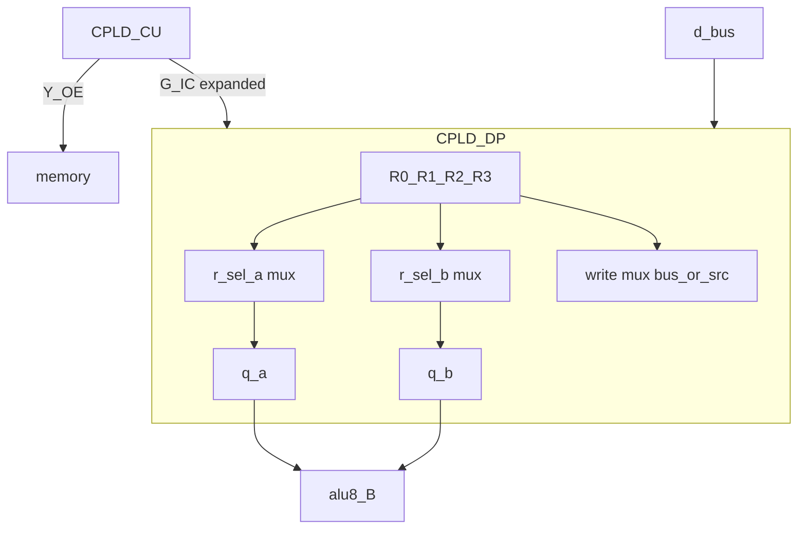

# Proposal — 4-GPR register file + STR

**Status:** Research target (not v1.0)  
**Parent:** [README.md](README.md)

---

## Motivation

v1.0 rev G fixes ALU operand reads to **R0→A** and **R1→B**, and restricts **STA** to **R0**. Algorithms that leave results in **R2** (e.g. ADD) need an extra **TFR** before every store. A conventional **4-register file** with **read select**, **write select**, and **store-from-selected-register (STR)** removes that traffic for many programs (e.g. Fibonacci can drop per-step `TFR02`).

---

## Target microarchitecture

### Register array

| Element | Spec |
|---------|------|
| Depth | **4** × 8-bit (R0–R3) |
| Storage | **32 FF** inside CPLD-DP (or split with external 574 — see P3) |
| Clock | Shared `CLK` (2 MHz), same as rev G |

### Control signals (conceptual)

| Signal | Width | Role |
|--------|------:|------|
| `reg_we` | 1 | Latch enable for selected write port |
| `w_sel` | 2 | Write destination (00–11 → R0–R3) |
| `r_sel_a` | 2 | Read port A → `q_a[7:0]` (ALU A) |
| `r_sel_b` | 2 | Read port B → `q_b[7:0]` (ALU B) |
| `xfer` / TFR | 1 | Write data from internal read mux vs `d_in[7:0]` |
| `r_sel_src` | 2 | Source for internal write mux (when `xfer=1`) |

**Unified model:** TFR is not a separate datapath — it is `reg_we` + `w_sel=dst` + `xfer=1` + `r_sel_src=src`. Whether six dedicated TFR opcodes remain in ISA is an encoding choice (see [arch-delta.md](arch-delta.md)).

### Bus / memory

| Operation | Behavior |
|-----------|----------|
| **LDA** | `reg_we`, `w_sel=dst`, data from `d_in` |
| **STR** | `Y_OE` drives bus from register selected by **store src** (encoding TBD — [str-encoding-options.md](str-encoding-options.md)) |
| **ADD / ALU** | `r_sel_a`, `r_sel_b` set per phase; result `w_sel` per template |

### ALU boundary

- Keep **16 output pins** on DP: `q_a[7:0]`, `q_b[7:0]` (full 8-bit, same as rev G).
- Replace hardwired `q_a←R0`, `q_b←R1` with **two independent 4:1 × 8-bit muxes**.

---

## Block diagram (target)

---

## G-IC growth (naive / P0)

Compared to rev G (6 wires), naive 4-GPR needs **+4** inputs on DP for `r_sel_a[1:0]` and `r_sel_b[1:0]`, unless `tfr_valid`+`src` are folded into a unified `r_sel_src` and timing-multiplexed (P1).

| Bundle | rev G | P0 naive |
|--------|------:|---------:|
| G-IC control wires | 6 | **8–10** (see [pin-budget.md](pin-budget.md)) |
| DP user I/O total | 31 | **35** (**FAIL**) |

---

## Success criteria (research)

1. Pin and MC budgets documented with arithmetic.
2. At least three implementation paths ranked (P0–P5).
3. STR encoding options compared without picking normative ISA yet.
4. PLD skeleton forked from rev G DP for local WinCUPL experiment.
5. No edits to `reference/**` in this work unit.

---

## Non-goals

- WinCUPL bitstream burn or breadboard bring-up.
- Compiler / cyclesim implementation (record impact only).
- Changing BOM or whitepaper.
