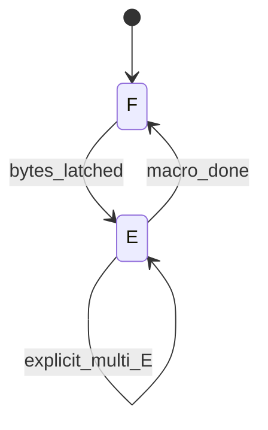

# Architecture sketch — FE1 / FE2 (research)

**Non-normative.** Baseline: shared SYS, dual CPLD, von Neumann bus ([M3b-fetch-execute.md](../../reference/hw-bringup/M3b-fetch-execute.md)).

## Shared BOM clock (unchanged)

```text
4 MHz XO --> 74HC74 /2 --> CLK_SYS 2 MHz
                              |
              +---------------+----------------+
              v               v                v
           CPLD-CU         CPLD-DP          574 / MEM
```

No PLL. No second oscillator. This study is about **CU schedule**, not µstep dual-clock ([cpld-ustep](../cpld-ustep/)).

## Gi1 CU today

```text
opcode x phase[1:0] --> idx5 LUT --> strobes
phase advances every SYS
idle rows legal (ADD ph0-1)
```

## FE1 sketch (stretch)

```text
one SYS edge:
  somehow fetch insn bytes AND perform execute on possibly different addr
```

Requires one of:

- **Harvard / dual memory port** (insn ROM port + data RAM port), or
- **ISA collapse** (no data mem in same insn as fetch; trivial toy), or
- **Absurdly slow SYS** so multiple internal async steps finish in one labeled “tick” (not breadboard-honest)

Not a drop-in CPLD LUT tweak on current wiring.

## FE2 sketch (primitive regression)

```text
state: F | E
  F: FETCH=1, PC on A-bus, latch IR / operand bytes per length
  E: FETCH=0, one strobe window (ALU or MEM or PC_LOAD)
  next insn -> F
```



### What changes vs Gi1

| Item | Gi1 | FE2 |
|------|-----|-----|
| Phase counter | 0..2 per template | **F/E** (+ documented multi-E) |
| ADD idle rows | ph0–1 empty | **Removed** |
| MEM_LD | 2 exec phases | Often **F + one E**; if addr setup needs bus, count as multi-E |
| CALL/RET | CU assist @ macro_end (may span) | **Programmer-visible** E×k stack |

### CPLD cost (desk)

- Simpler than idx5×3 idle tables for ALU_REG.
- CALL/RET still need stack sequencer — same class of problem as [call-ret-cu-fit](../call-ret-cu-fit/); must expose cost in the timing sheet.

## Contrast with cpld-ustep

| | ustep | this study |
|--|-------|------------|
| Idle ADD phases | Move to USTEP | **Delete** from schedule |
| Teaching e-IPC via phase variety | Keep | **Not a goal** |
| Programmer clock story | SYS-visible DP | **All SYS = work** |

## Change log

| Date | Note |
|------|------|
| 2026-07-13 | Initial |
